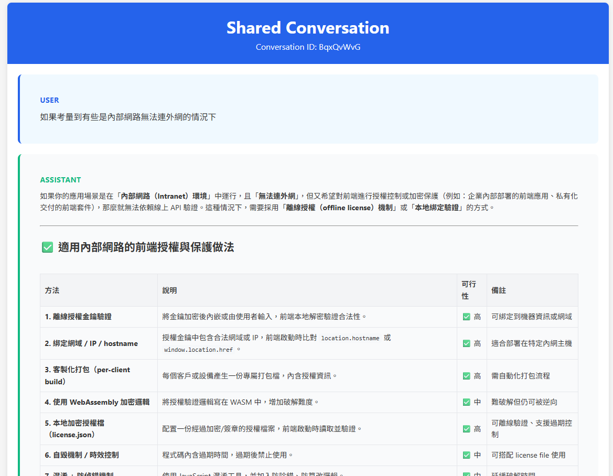

[](https://opensource.org/licenses/MIT)
[](https://nodejs.org/)
[](https://workers.cloudflare.com/)
[](https://developer.mozilla.org/zh-TW/docs/Web/JavaScript)
[](https://highlightjs.org/)




# ShareGPT Cloudflare Worker

一個在 Cloudflare Workers 上運行、類似 ShareGPT 的對話分享服務。

## ✨ 特色

- 📤 **快速分享**：POST 對話 HTML 或 JSON，即可獲得可分享連結
- 🔗 **唯一網址**：每段對話使用 8 位隨機 ID
- 🎨 **美觀排版**：類似聊天泡泡的響應式版面
- ⚡ **極速全球**：依託 Cloudflare 邊緣網路
- 🔒 **安全設計**：速率限制、XSS 防護、內容驗證
- 💾 **雙格式儲存**：同時保存解析後與原始 HTML
- 📱 **行動友好**：任何裝置皆可完美瀏覽
- 🧠 **智慧解析**：HTMLRewriter + Regex，多層級兼容各種格式
- 🛠️ **原生 Worker**：無需 DOMParser，相容性佳

## 🚀 快速開始

### TL;DR

1. 複製 `worker.js` 內容到你的 worker
2. 修改 `env.sharegpt` 為你的 KV 綁定變數
3. 部屬 `worker`


### 先決條件

1. 具有啟用 Workers 的 Cloudflare 帳號
2. 本地安裝 Node.js
3. 安裝 Wrangler CLI

### 安裝與設定

1. **下載與安裝依賴**
   ```bash
   git clone https://github.com/aliceric27/Share-GPT-CF-Worker.git
   cd Share-GPT-CF-Worker
   npm install
   ```

2. **建立 KV Namespace**
   ```bash
   # 正式環境
   npm run create-kv

   # 預覽環境
   npm run create-kv-preview
   ```

3. **更新組態**
   - 將 CLI 輸出的 Namespace ID 填入 `wrangler.toml`
   - 綁定名稱預設為 `sharegpt`，與程式碼一致

4. **本地測試**
   ```bash
   npm run dev
   ```
   預設網址： <http://localhost:8787>

5. **部署**
   ```bash
   npm run deploy
   ```

## 🌐 API 端點

### POST `/`
上傳對話內容並取得分享連結。

**Request Body**
```json
{
  "html": "<div>你的對話 HTML ...</div>"
}
```

**Response**
```json
{
  "success": true,
  "id": "abc123XY",
  "url": "https://your-worker.workers.dev/abc123XY"
}
```

### GET `/{id}`
瀏覽分享頁面。

### GET `/`
顯示上傳表單介面。

## 📦 支援的對話格式

1. **JSON 陣列（最高優先）**
   ```json
   [
     {"from": "human", "value": "你好"},
     {"from": "gpt", "value": "哈囉！"}
   ]
   ```
2. **ChatGPT Web HTML**（`data-message-author-role` 與 `.message-content`）
3. **Regex 後援**：`User:`、`Assistant:` 等簡易文字格式

系統會依序嘗試上述解析方式，最大化相容性。

## ⚙️ 組態

| 參數 | 說明 | 預設 |
|------|------|------|
| `ENVIRONMENT` | `production`